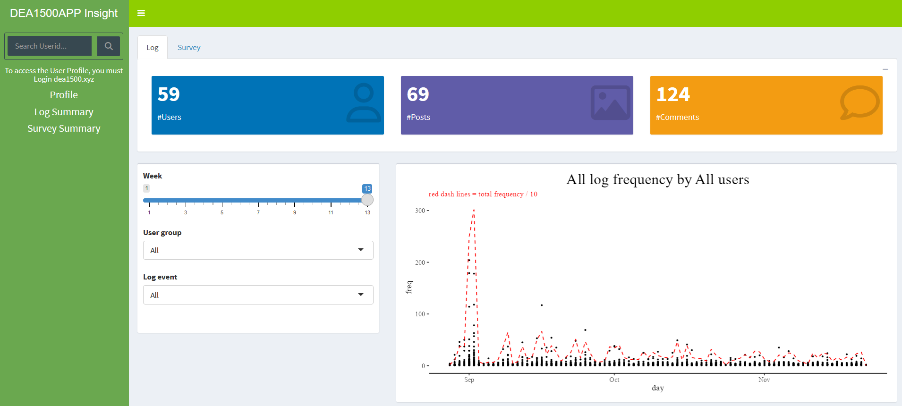
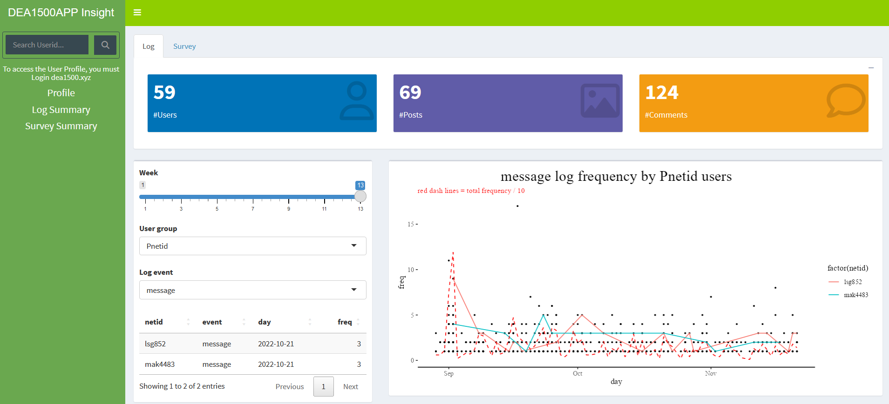
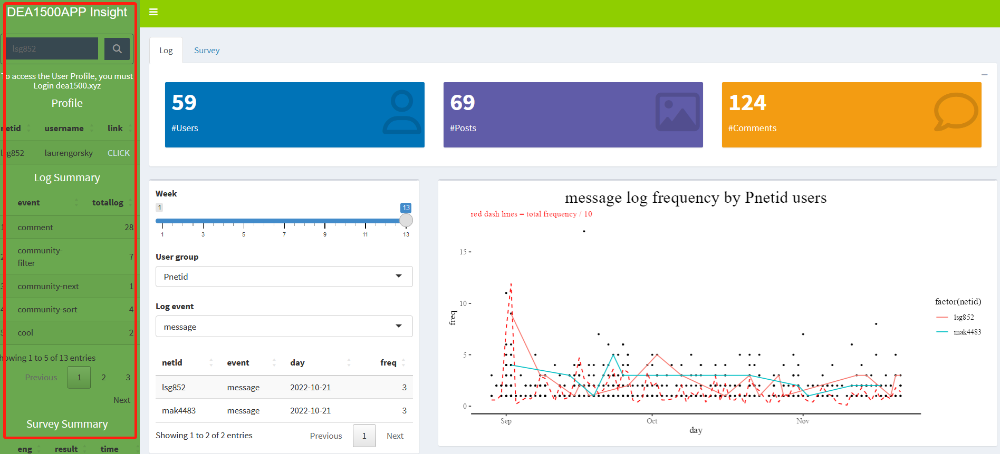
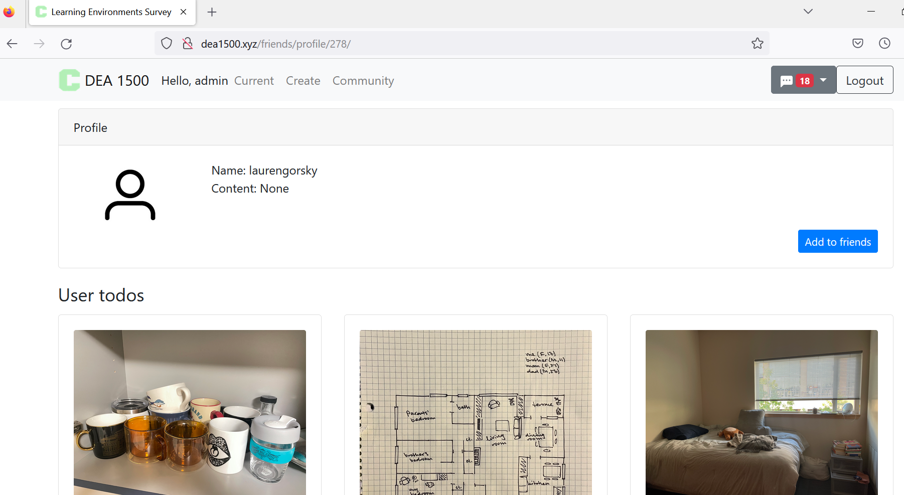

```{r, include = FALSE}
knitr::opts_chunk$set(
  collapse = TRUE,
  comment = "#>"
)
```

```{r setup}
library(learningdashboard)
```

This is the introduction to learningdashboard package.
This package include a dataset including several tables of students log and survey data in Dea1500 Community App during the semester and a shiny app to visulize this dataset.

# The Layout
Log tab: include key metric box area, input area, and plot area.
Survey tab: the same structure with Log tab.
Sidebar: search user information based on Userid.

```{r out.width = "30%"}

```

# Log Tab
## Input area
Week slider controls the key metric box values.
User group and Log event filter the data visualized in the plot area.
## Plot area
Each point represents the log frequency for a user in each day.
Click the point of interest, its information including the user id, event type, and frequency will be shown in the area below the Input area. And this user's all related log data will be connected to a line. If there are overlapped points, each user's information will be shown and their logs will also be connected to lines and differentiated using different colors.
```{r out.width = "30%"}


```

# Sidebar
Search the user information by inputing the user id in the searh area and click the searching button.
This feature can work with the interactive plot.
The profile link leads to the user's profile page in http://dea1500.xyz. You need to login to this website to access the profile page. If you do not have an account, just sign up and register one. 
```{r out.width = "30%"}


```

# Profile page
```{r out.width = "30%"}


```


